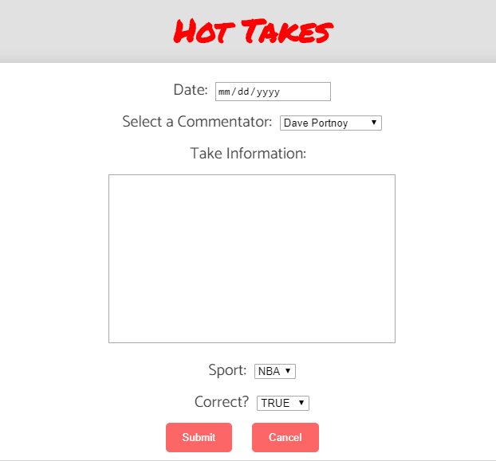

# Hot Takes

## Live Link to App
https://hot-takes-app.lucasrobitaille.now.sh/

## Api Link
https://github.com/robitaille1/hot-takes-api

## Summary
Hot Takes is an app I have always wanted to create.
I created Hot Takes with the intention of it becoming something similar to Rotton Tomatos, but for sports commentary. I watch a lot of sports, and always see commentators with takes that don't really make sense, and commentators who don't intend to be factual or correct.

This app assists in keeping track of what commentators say and their predictions made. It provides each commentator with a hot takes score, to easily show the use who the most reliable commentator is.

### Add a Commentator
If you don't see a commentator that you are looking for, add them! The more commentators the merrier. 

### Add a Take
Add Takes to a commentator in order to keep their score up to date. If someone said something ridiculous, add it! Likewise, if someone said something reasonable, add that too!

## Tech Used
This application was made using:
React, Redux, Express, Node, HTML, CSS
